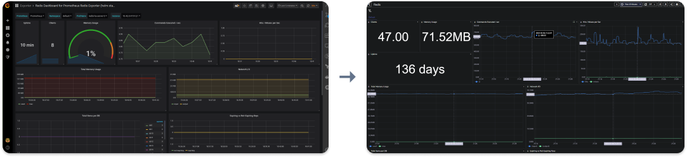

# Converter
Convert a Grafana Dashboard to OpenObserve



# Usage
- Generate the OpenObserve dashboard ```go run main.go -input <file_to_grafana_dashboard.json> -output <output.json>```
- Import the `<output.json>` Dashboard in OpenObserve

# Caveats
Please note that this is still an early prototype. It has successfuly converted multiple dashboards, but you will have to do some manual clean-up, like:
- remove obsolete dynamic variables
- clean up some PromQL queries
- change chart type
- no Tabs (everything is in Default). I plan to convert Grafana "row"s to OpenObserve tabs. 

Right now I don't think that it's possible to perfectly convert a Grafana dashboard to OpenObserve, because Grafana has much more chart configuration options right now. 